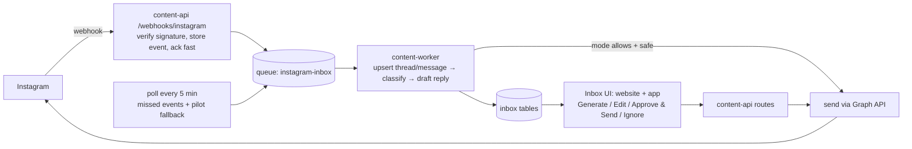

# Instagram Inbox: comment & DM replies — implementation plan

Status (5 Oct 2026): Meta setup, token renewal and the webhook receiver are live. **Step 1 is
built:** `inbox_settings` (per-brand switch + the account it reads), `inbox_threads` and
`inbox_messages` (migration 0039); `content-worker/src/pipeline/instagram-inbox-sync.ts` drains
webhook events every minute and polls each enabled account's comments (10 newest posts) and DMs
every 5 minutes; `PUT /brands/:id/inbox-settings` + a switch on the website's Settings page.
The read-only **Inbox page** followed (website `/inbox`: Needs reply / All, Comments / DMs,
conversation drawer with the post's caption and the 24 h DM window; API `GET /inbox/threads`,
`GET /inbox/threads/:id`; migration 0040 adds the post caption and link to comment threads).
**AI drafts** followed (`content-worker/src/pipeline/inbox-draft.ts`, migration 0041 draft columns on
`inbox_threads`, queue `instagram-inbox-draft`, `POST /inbox/threads/:id/draft` to regenerate; editable
"Suggested reply" box with Copy). Next: sending.

**Confirmed live (5 Oct 2026): Standard Access hides other people's data.** On the real account,
a post reported `comments_count: 1` while `/comments` returned `[]`: the commenter had no role on
the Meta app. `me/conversations` also failed with "Application does not have permission for this
action". So the tester shortcut only works for comments and DMs _from_ tester accounts; a pilot
with real customers needs **Advanced Access (Business Verification + App Review)** first.

Original plan (2 Oct 2026). A client needs Instagram comments and DMs
answered in their brand voice, with AI drafting, human approval where it matters, and
automatic replies for safe cases.

## What we already have (reused, not rebuilt)

| Piece                                                                    | Where                                                                   | Reused for                        |
| ------------------------------------------------------------------------ | ----------------------------------------------------------------------- | --------------------------------- |
| Instagram Login connection (no Facebook Page), encrypted tokens          | `apps/content-api/src/social/social.service.ts`, `core.social_accounts` | Same login; two more permissions  |
| Comment fetching + `content.post_comments` table                         | `apps/content-worker/src/pipeline/instagram-insights-sync.ts`           | Polling fallback, comment storage |
| Brand voice context (identity, tone, banned topics, learned preferences) | `getContentContext` / `renderBrandContextLines` in `packages/db`        | Reply prompt                      |
| AI reply drafting pattern + cost logging                                 | `apps/content-api/src/google/google-reviews.service.ts`                 | Same shape, moved to the worker   |
| Queues/workers, push + bell notifications                                | `content-worker`, `notifyBrandOwner`                                    | Processing, "new message" alerts  |
| Brand Brain feedback signals                                             | `recordFeedbackSignal`                                                  | Learning from human edits         |
| Public HTTPS API on AWS                                                  | `https://api.3-24-200-83.sslip.io`                                      | Webhook endpoint                  |

**Gaps found while planning:**

- **No Instagram token refresh.** Long-lived tokens expire after ~60 days, and nothing
  renews them (this is why the local connection is dead). An always-on inbox needs one.
- **Only `basic`, `content_publish` and `manage_insights` permissions are requested.**
  Replying needs `instagram_business_manage_comments`. DMs need
  `instagram_business_manage_messages`. Every account reconnects once.

## Meta requirements — the schedule risk

Checked against Meta's webhook docs on 2 Oct 2026; Meta changes these rules often.

- **Permissions:** add `instagram_business_manage_comments` and
  `instagram_business_manage_messages` to the app and to the consent screen.
- **Webhooks:** register a callback URL and verify token in the App Dashboard, and subscribe
  to `comments`, `messages` and `message_echoes` (replies typed in the Instagram app). Each
  connected account must also be subscribed (`POST graph.instagram.com/me/subscribed_apps`).
- **Meta only sends webhooks to a Live (published) app.** In Development mode nothing
  arrives at all.
- **Comment webhooks need Advanced Access**, which means **Business Verification + App
  Review** (screencast of the flow): **1–4 weeks of Meta waiting time**. Business
  Verification starts on day 1; App Review is submitted once the inbox works (week 2).
  - **Pilot path:** publish the app (Live) with Standard Access and add the client's
    Instagram account as a tester. The API calls work for that account. **Comments come in
    through the 5-minute polling check** until Advanced Access lands; DM webhooks are tested
    on day 1 and polled the same way if Standard Access doesn't deliver them.
- **Signing secret:** the docs say "your app's App Secret", and an Instagram Login app has
  two (Meta app secret, Instagram app secret). The receiver accepts either and logs which one
  Meta used.
- **24-hour DM window:** a business can reply to a DM only within 24 h of the customer's last
  message (a human-agent tag stretches this to 7 days and needs its own approval). The inbox
  shows a countdown; auto-replies land in minutes, so they are unaffected.
- **Loop safety:** our own replies come back as webhook events (DM echoes, our comment
  replies). They must never trigger a reply.

## Architecture

- The webhook route only verifies the `X-Hub-Signature-256` HMAC (raw body + app secret),
  stores the raw event idempotently, enqueues it and returns 200. It does no AI work, keeping
  the rule that APIs never call a model directly. It is public (no JWT; the signature is the
  auth) and exempt from the rate limiter.
- **Polling reconciliation** runs every ~5 min per connected account. It covers missed
  webhooks while the box restarts, and is the pilot fallback if webhooks need Live mode:
  comments come from the existing fetch code, DMs from the conversations endpoint.
- The worker runs one Flash JSON call per inbound message. It returns the **category**
  (question, price/availability, complaint, refund/legal, praise, spam, other), the
  **language**, a **confidence** score and a **draft reply** in that language. Safety routing
  then decides whether it may auto-send.

## Data model (one migration, additive)

| Table                              | Holds                                                                                                                                                                                                                                                                       |
| ---------------------------------- | --------------------------------------------------------------------------------------------------------------------------------------------------------------------------------------------------------------------------------------------------------------------------- |
| `content.inbox_threads`            | One per DM conversation or per top-level comment: brand, account, channel (`comment`/`dm`), IG ids, customer handle, post (for comments), `status` (`needs_reply`/`drafted`/`awaiting_approval`/`replied`/`ignored`), `last_customer_message_at` (24 h window), unread flag |
| `content.inbox_messages`           | Every inbound and outbound message: thread, IG message/comment id (unique — dedupes webhook + poll), direction, text, attachments, sent_at                                                                                                                                  |
| `content.inbox_replies`            | Each AI draft: category, language, confidence, `ai_text`, `final_text` (after human edit), decided_by (`auto`/user), status (`draft`/`approved`/`sent`/`failed`/`ignored`), error, cost reference                                                                           |
| `content.inbox_settings`           | Per brand: mode per channel (`manual`/`approval`/`auto`), categories allowed to auto-send, confidence threshold, daily auto-reply cap, pause switch                                                                                                                         |
| `content.instagram_webhook_events` | Raw payloads, for debugging and replay (pruned after 30 days)                                                                                                                                                                                                               |

**Privacy-policy promises these tables must keep** (`apps/web/src/app/privacy`, 2 Oct 2026):
the inbox is **off until a brand turns it on** (no AI drafting before that); inbox
threads/messages/replies **cascade-delete with the social account** on disconnect; raw webhook
events are deleted after 30 days and on disconnect (already implemented).

`post_comments` stays as the analytics store. The inbox links to it by IG comment id
rather than replacing it.

## Reply modes and safety rules

| Mode                   | Behaviour                                                                                     |
| ---------------------- | --------------------------------------------------------------------------------------------- |
| Manual                 | AI drafts are suggestions; nothing is sent without a click                                    |
| Approval (**default**) | AI drafts everything; a human approves or edits, then it sends                                |
| Auto                   | AI sends by itself **only** when every rule below passes; otherwise it falls back to Approval |

Rules, applied in the worker before any automatic send:

- Complaint, refund, legal/threat, or anything the model is unsure about (confidence below the
  threshold) → **always human approval**, in every mode.
- Simple product/price/availability/hours questions, thanks, praise → may auto-send in Auto mode.
- Spam or abuse → no reply; flagged for the human (optionally hide the comment).
- Never reply to our own account's messages/comments; at most one auto-reply per thread per
  customer message; daily auto-reply cap per brand; one-click **pause all auto-replies**.
- No invented facts: prices, stock or policies come only from the brand context (Brand Brain /
  product catalog). If the answer isn't there, the draft says a human will follow up and the
  thread goes to approval.

## Phases and effort

Estimates are developer-days for one developer working with Claude Code, following the
requested order. Meta's review time is calendar time and runs in parallel.

| #   | Phase (requested task)         | Work                                                                                                                                           | Days                   |
| --- | ------------------------------ | ---------------------------------------------------------------------------------------------------------------------------------------------- | ---------------------- |
| 0   | Meta setup (1)                 | Add both permissions, register webhook, start Business Verification + App Review, add client as tester; probe the API with a real test account | 1 (+1–4 wks Meta wait) |
| 1   | Connect Instagram (2)          | New scopes + reconnect prompt, `subscribed_apps` call on connect, **token refresh job**                                                        | 1                      |
| 2   | Webhooks (3)                   | Verify endpoint, HMAC check (raw body), event store + queue, poll reconciliation, echo/loop guard                                              | 2                      |
| 3   | Database (4)                   | Migration for the 5 tables, upsert/dedupe logic, shared Zod contracts                                                                          | 1                      |
| 4   | AI replies (6)                 | Worker job: brand context + thread history → category, language, confidence, draft; tests on sample messages in English/Hindi/Hinglish         | 2                      |
| 5   | Reply actions + sending (7, 8) | API: list/get threads, generate, edit, approve & send, ignore; send comment replies and DMs; 24 h window check; no double sends                | 2                      |
| 6   | Modes + safety (9, 10)         | Settings, safety routing, caps, pause switch, notifications for items needing a human                                                          | 1                      |
| 7   | Feedback (11)                  | Store AI vs final text; feed edits into Brand Brain; recent edits as style examples in the prompt                                              | 1                      |
| 8   | Inbox UI — website (5)         | Inbox page with Comments / DMs tabs, unanswered filter, thread history, reply composer with the four actions, settings panel, sidebar badge    | 3                      |
| 9   | Inbox UI — phone app (5)       | Same flows as app screens (can follow the website)                                                                                             | 2–3                    |
| 10  | Real-brand testing (12)        | Test account → client account: comments, DMs, languages, complaints, approval and auto paths; deploy + watch logs                              | 2                      |
|     | **Total**                      | Backend ≈ 11, website 3, app 2–3, testing 2                                                                                                    | **≈ 18–19 days**       |

So it is roughly **3.5–4 weeks of work**. A website-only pilot (skipping phase 9) is
**≈ 16 days**. The only hard external dependency is Meta: the client's account can be served
on the tester shortcut while App Review runs.

**Suggested milestones:**

1. **Week 1:** Meta setup + connection + webhooks + database. Real comments/DMs from a test
   account land in the database.
2. **Week 2:** AI drafts + Approve & Send + website Inbox. The pilot can run in Approval mode.
3. **Week 3:** Auto mode + safety rules + feedback loop + real-brand testing on the client.
4. **Week 4:** phone app screens, App Review follow-ups, polish.

## Risks

| Risk                                                   | Mitigation                                                                                                                              |
| ------------------------------------------------------ | --------------------------------------------------------------------------------------------------------------------------------------- |
| App Review / Business Verification delays or rejection | Start day 1; pilot on tester access; polling fallback                                                                                   |
| A wrong automatic reply to a real customer             | Approval mode by default; Auto only for safe categories above a confidence bar; caps; pause switch; every auto-reply logged and visible |
| DM window expires before a human approves              | Countdown in the inbox; push notification when something needs approval                                                                 |
| Token expiry silently stops the inbox                  | Refresh job + "reconnect needed" alert                                                                                                  |
| Single EC2 box down → missed webhooks                  | Meta retries for a while; the 5-min poll reconciles anything missed                                                                     |
| Customer DMs are personal data                         | Owner-only access (existing brand ownership checks); retention limit on raw events; covered by the existing data-deletion page          |

## Open questions for the client / team

1. Is the client's Instagram a **Business or Creator** account, and can we add it as a
   **tester** on our Meta app for the pilot?
2. Which **languages** do their customers use (English, Hindi, Hinglish, others)?
3. Which questions are safe to **auto-answer** at launch, and is their price/stock/policy
   information in the Brand Brain and product catalog?
4. **Website only** for the pilot, or the phone app too?
5. Who approves replies on their side, and how fast? This sets whether the 24 h DM window is
   a real constraint.
